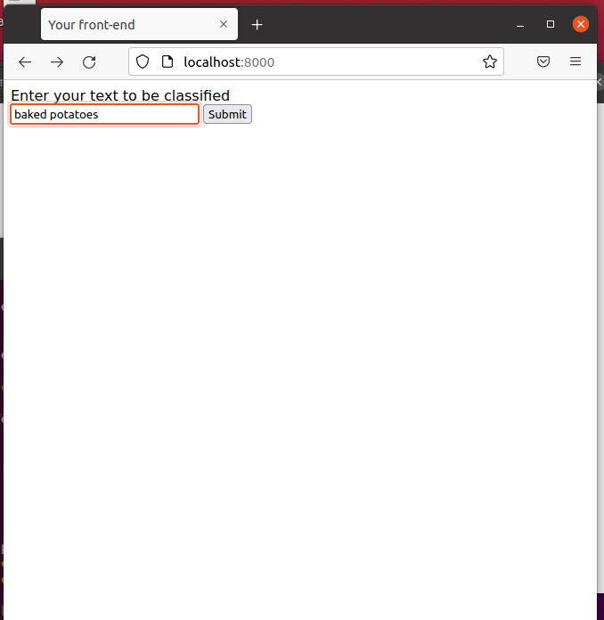
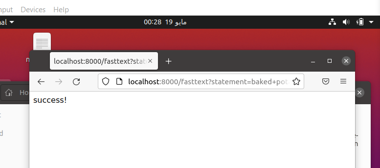
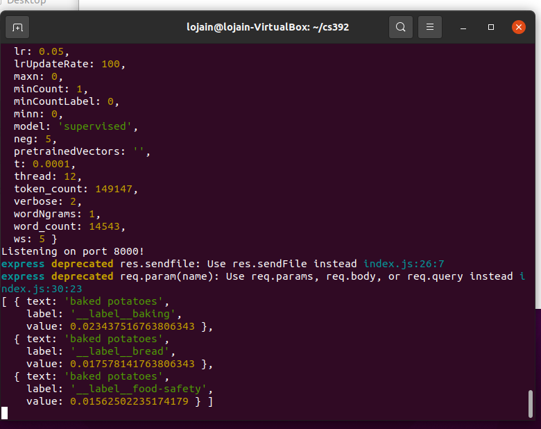
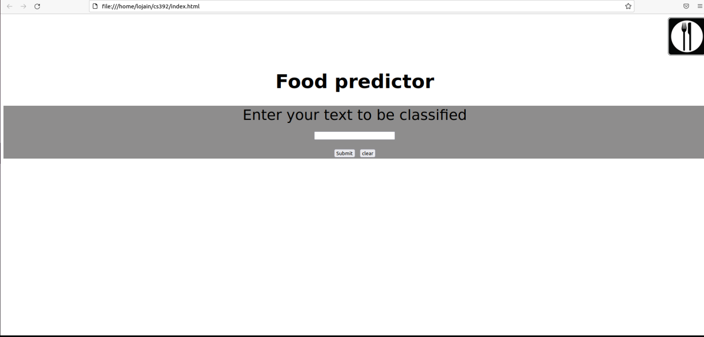
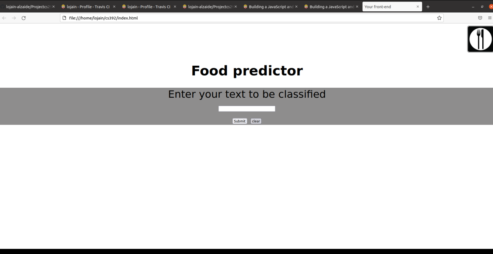

# Projectcs292
# Table of content
- Introduction
- Installation
- How to use
- Travis CI tool integration
- Releases

# Introduction
The project about software engineering 2 is consists of two release and testing. 
# Installation
First, we download the  files on ubuntu. second follow the steps will show you how to set up a Node js server to run the core system of the machine learning (fasttext tool for text classification) on input from a user.
1.	Download npm: sudo apt install npm
2.	Create and open project folder: mkdir [your choice name]
3.	Initialize requirements: npm init -y
4.	Install the Node.js sandbox for the Machine learning algorithm (fasttext): npm install node- fasttext --save
5.	Install Express: npm install express --save
6.	Install some cors issues: npm install cors --save
7.	Now if you want to get this sandbox up and running pretty quick you go ahead and use my HTML and J's files (provided on this URL) and once you have done.
8.	Run index.js: node index.js

# How to use 
When we did install it, the last command will show you your port number,open your browser and write "localhost:8000". 
this picture show you what will appear,then type any food that exist in "trian.text" and press submit

The result that will appears "success"

In the terminal wil show you all labels correspoding to the word you write

# Releases
We built two releases first one was v0.0.0 .

the second was v0.1.0 .
We changed UI and add "clear" button as shown in the picture

If the user clicks the submit button it should dynamically show the result in a table but it didn't show up in my html page although there's a code for the table. This's one of the problems I faced, it's possibly becouse of my lack of knowledge in HTML & JavaScript but i did what I could do.

# Travis CI tool integration
Unfortunately Travis CI tool integration did not work we tried to fix the issue, but run out of time.
# Contributors
Prepared by Noura Alosaimi, Lojain Alzaide & Njoud Mohammed
